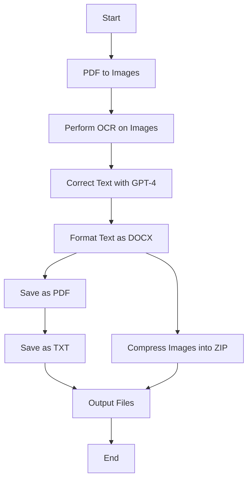

# OCR PDF Processing System

This repository provides a complete system for processing PDF files by extracting text using OCR, correcting errors with the OpenAI GPT-4 model, and formatting the corrected text in multiple formats.

## Table of Contents

- [Requirements](#requirements)
- [Installation](#installation)
- [Usage](#usage)
- [Features](#features)
- [Implementation Steps](#implementation-steps)
- [Diagram Flow](#diagram-flow)
- [Output](#output)
- [Contributing](#contributing)
- [License](#license)

## Requirements

To run this project, ensure you have the following prerequisites:

- Python 3.7+
- Tesseract OCR
- OpenAI API Key with access to GPT-4
- Libraries: `pdf2image`, `pytesseract`, `python-docx`, `reportlab`, `zipfile`, `openai`, `dotenv`, `Pillow`

## Installation

### Step 1: Clone the Repository

```bash
git clone https://github.com/Ismat-Samadov/OCR.git
cd OCR
```

### Step 2: Install Dependencies

Create a virtual environment and install the required Python packages:

```bash
python3 -m venv venv
source venv/bin/activate  # On Windows use: venv\Scripts\activate
pip install -r requirements.txt
```

### Step 3: Install Tesseract OCR

#### On Ubuntu

```bash
sudo apt-get update
sudo apt-get install tesseract-ocr
```

#### On MacOS

```bash
brew install tesseract
```

#### On Windows

Download the Tesseract installer from [Tesseract OCR](https://github.com/tesseract-ocr/tesseract/wiki) and install it.

### Step 4: Configure OpenAI API Key

Create a `.env` file in the root directory and add your OpenAI API key:

```plaintext
OPENAI_API_KEY=your_openai_api_key_here
```

## Usage

1. **Place your PDF file** in the root directory and rename it to `file.pdf`.

2. **Run the script**:

   ```bash
   python convert.py
   ```

3. **Check the output files** in the root directory.

## Features

- **PDF to Image Conversion**: Converts each page of a PDF into an image using `pdf2image`.
- **OCR Text Extraction**: Extracts text from images using Tesseract OCR.
- **Text Correction**: Corrects text using OpenAI's GPT-4 model for spelling and grammatical errors.
- **Formatted Text Output**: Saves the corrected text in DOCX, PDF, and TXT formats with specified font, size, and spacing.
- **Image Compression**: Compresses extracted images into a ZIP file for storage.

## Implementation Steps

### Step 1: Convert PDF to Images

Using the `pdf2image` library, convert each page of the PDF into an image.

### Step 2: Perform OCR on Images

Use Tesseract OCR (`pytesseract`) to extract text from each image.

### Step 3: Correct Text with OpenAI GPT-4

Send the extracted text to OpenAI's GPT-4 model to correct spelling and grammatical errors.

### Step 4: Format and Save Corrected Text

- **DOCX**: Format text with `python-docx` using Times New Roman, font size 10, and spacing 1.5.
- **PDF**: Use `reportlab` to create a PDF with the same formatting.
- **TXT**: Save the corrected text as a plain text file.

### Step 5: Compress Images into ZIP

Use Python's `zipfile` library to compress all images into a ZIP file.

## Diagram Flow

Below is a flowchart diagram illustrating the workflow of the PDF processing system:



## Output

- **output.docx**: Formatted Word document with original and corrected text on separate pages.
- **output.pdf**: Formatted PDF document with original and corrected text on separate pages.
- **output.txt**: Plain text file containing original and corrected text with clear separation.
- **images.zip**: Compressed file containing all extracted images.

## Contributing

Contributions are welcome! Please open an issue or submit a pull request for any bugs or improvements.